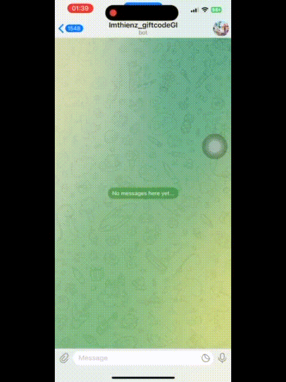

# Telegram Bot Projects
A Telegram bot that helps you redeem Genshin Impact gift codes.
## 🎬 DEMO


## Genshin Impact Gift Code Bot [[GI-bot](https://github.com/ImThienz/telegram-bot-PC/tree/GI-bot)]

### 1. Local Version (old-genshin_bot.py)
- **Environment**: Runs locally on your machine
- **Features**:
  - Scrapes gift codes from multiple sources (Hoyolab, Wiki, Reddit)
  - Supports OCR for reading codes from images using Tesseract
  - Auto-detects server based on UID
  - Generates direct redemption links
  - Supports development mode with auto-reload
- **Setup**:
  ```bash
  # Install dependencies
  pip install python-telegram-bot beautifulsoup4 requests python-dotenv watchdog pytesseract pillow

  # Install Tesseract OCR
  # Windows: Download and install from https://github.com/UB-Mannheim/tesseract/wiki
  # Set path in code: pytesseract.pytesseract.tesseract_cmd = r'C:\Program Files\Tesseract-OCR\tesseract.exe'

  # Create .env file
  BOT_TOKEN=your_bot_token_here

  # Run bot
  python old-genshin_bot.py
  ```

### 2. PythonAnywhere Version (genshin_bot.py)
- **Environment**: Runs on PythonAnywhere hosting
- **Key Differences**:
  - Uses OCR Space API instead of local Tesseract
  - Simplified environment setup
  - Optimized for cloud hosting
- **Setup**:
  ```bash
  # Install dependencies
  pip install python-telegram-bot beautifulsoup4 requests

  # Set API keys directly in code
  BOT_TOKEN = "your_bot_token_here"
  OCR_SPACE_API_KEY = "your_ocr_space_api_key_here"

  # Run bot
  python genshin_bot.py
  ```

## Security Notes
- Never commit your bot tokens or API keys to version control
- Use environment variables or secure configuration files
- Keep your bot tokens private and rotate them regularly

## Development
- Both bots use the python-telegram-bot library
- Local version includes development mode with auto-reload
- PythonAnywhere version is optimized for cloud hosting

## License
This project is open source and available under the MIT License.
